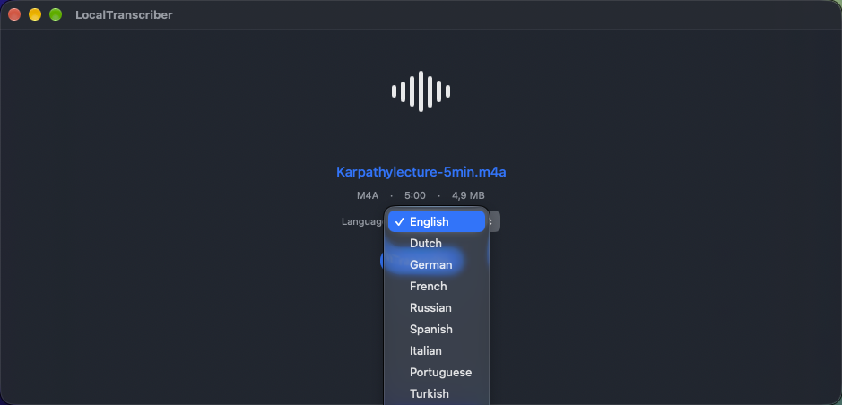
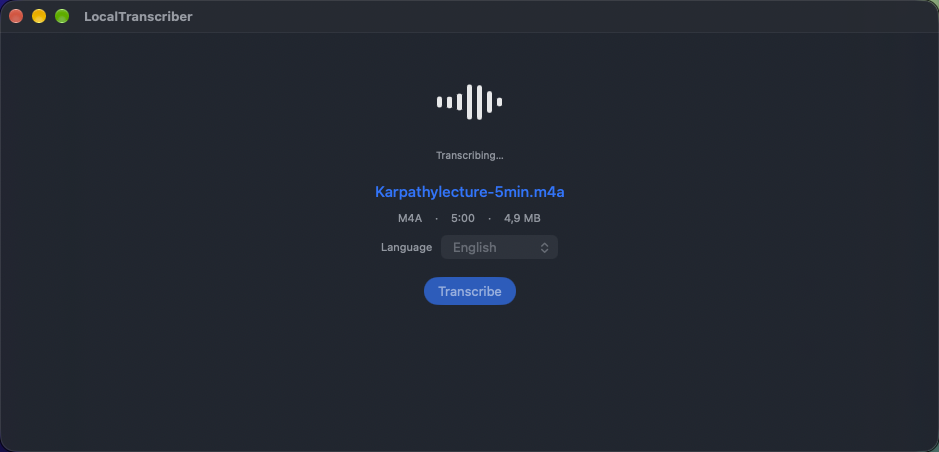
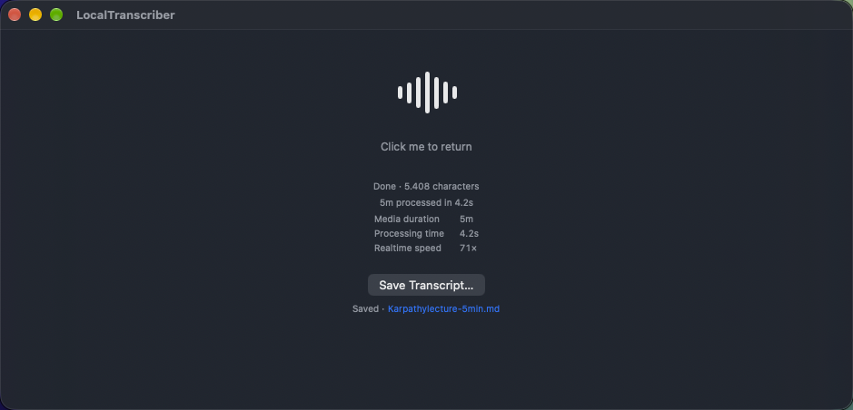

# Local Transcriber

**Media in. Markdown out.**

Local Transcriber is a small native macOS utility for turning local audio and video into timestamped Markdown transcripts with Apple's on-device speech stack.

Drop in a file, choose the language, and let the app handle the rest.

No accounts. No cloud transcription service. No model picker.

<p align="center">
  
</p>

## What it does

Drop an MP4, MOV, M4A, MP3, or WAV file. Audio files are transcribed directly. For video, AVFoundation extracts the audio to a temporary M4A before transcription.

## Languages

| Language | Locale |
| --- | --- |
| English | `en-US` |
| Dutch | `nl-NL` |
| German | `de-DE` |
| French | `fr-FR` |
| Russian | `ru-RU` |
| Spanish | `es-ES` |
| Italian | `it-IT` |
| Portuguese | `pt-BR` |
| Turkish | `tr-TR` |
| Swedish | `sv-SE` |

The app checks Apple's native speech modules for an exact locale match and automatically selects a path when one is available. Locale availability depends on macOS support for that language. Apple speech modules are used internally; there is no engine picker. macOS may download and install Apple language assets before transcription when a selected language needs them.

## How it works

```text
Drop media
    ↓
Choose language
    ↓
Normalize video audio if needed
    ↓
Prepare native language assets if needed
    ↓
Transcribe on-device
    ↓
Timestamped Markdown
```

| Choose language | Transcribe | Save Markdown |
| --- | --- | --- |
|  |  |  |

## Output

Choose **Save Transcript…** to write a `.md` file. The document title comes from the source filename. Transcript segments are ordered by audio time, grouped by minute, and headed with the first segment's timestamp in each group.

The saved Markdown includes the source, duration when available, selected locale, and Apple engine metadata:

```markdown
# example

**Source:** `example.m4a`
**Duration:** 00:05:00
**Language:** en-US
**Engine:** Apple SpeechAnalyzer

## Transcript

### 00:00:00

Transcript text...
```

## Performance

After a run, the app reports media duration, processing time, and realtime speed, calculated as media duration divided by processing time. These are per-run measurements. Results vary by hardware, language, source media, and the native transcription path selected for the locale.

## Privacy

For local files, media is processed on the Mac with AVFoundation and Apple's on-device speech stack. The app has no media upload, cloud transcription, account, or external model API. macOS may download Apple-provided language assets when required.

## Non-goals

No cloud transcription, accounts, summarization, knowledge base, AI transcript cleanup, user-facing model picker, or transcript editor.

## Status

Early-stage macOS project focused on local transcription and Markdown export.
