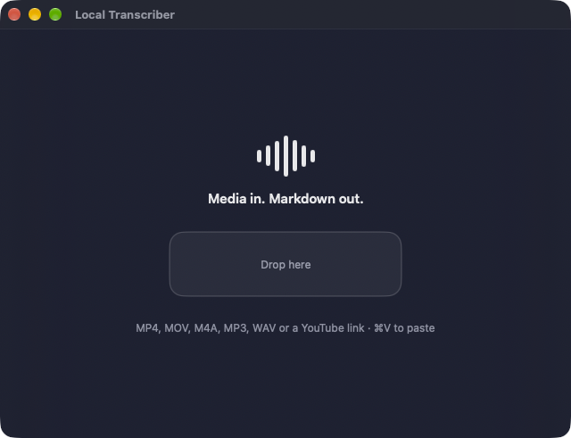
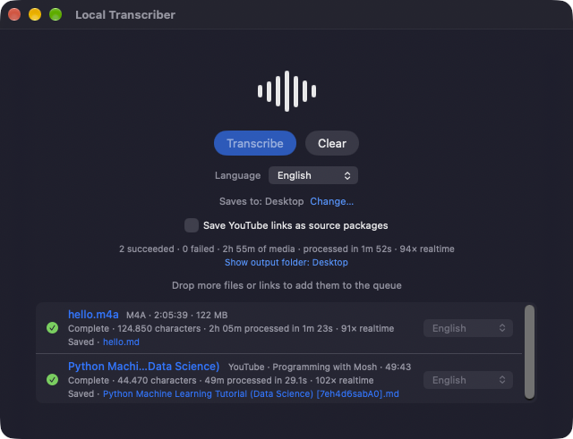

# Local Transcriber

**Media in. Markdown out.**

Local Transcriber is a native macOS app that turns audio, video and YouTube links into timestamped Markdown transcripts. Speech recognition runs on your Mac with Apple's on-device speech stack; there is no cloud transcription service, no account and no model picker.

<p align="center">
  
  &nbsp;
  
</p>

## What it does

Drop in media files or paste YouTube links. Everything goes into one queue that runs one job at a time. Each finished transcript is written straight to a folder you chose once.

```text
media file or YouTube link
        │
        ▼
   one queue  ──  per-job language, run sequentially
        │
        ▼
 on-device transcription (Apple speech stack)
        │
        ▼
 timestamped Markdown in your output folder
```

The product boundary is deliberate: `media or URL -> local transcript package`. The transcript is the artifact. The app does not summarize, index, search, rewrite or "clean up" what was said.

## Inputs

- **Local files:** MP4, MOV, M4A, MP3 and WAV. Audio files are transcribed directly; for video, AVFoundation first extracts the audio to a temporary M4A.
- **YouTube links:** `youtube.com` (including `www.`, `m.` and `music.`) and `youtu.be` watch, shorts, live and embed links. Playlist parameters are dropped, so a link transcribes one video.
- **How to add them:** drag onto anywhere in the window, or copy and press ⌘V. Dropping a link from a browser's address bar works after selecting the URL first (observed in Safari only).

Files with other extensions are ignored. A link that is not a supported YouTube link, or a video that cannot be fetched, fails only its own row and never stops the others.

## The queue

- Jobs run sequentially: `Waiting → Downloading → Transcribing → Complete | Failed`. Downloading applies to YouTube links only.
- **Language** is set per job. A queue-level selector sets the default for new jobs, and **Apply to all** changes every job that is still waiting. A job's language is fixed once it starts.
- Waiting jobs can be removed, **Clear** empties an idle queue, and **Retry** puts a failed job back in line. A rejected link cannot be retried, and completed jobs are never touched.
- A summary line shows succeeded and failed counts, total media duration, processing time and realtime speed.
- If an automatic save fails, the job stays complete and offers **Save Transcript…** as a manual fallback.

### Languages

English (`en-US`), Dutch (`nl-NL`), German (`de-DE`), French (`fr-FR`), Russian (`ru-RU`), Spanish (`es-ES`), Italian (`it-IT`), Portuguese (`pt-BR`), Turkish (`tr-TR`) and Swedish (`sv-SE`).

For the chosen language the app looks for an exact match in Apple's speech modules and uses whichever one supports it. Availability depends on what macOS offers for that language, and macOS may download Apple's language assets the first time a language is used.

## Output

The first time you transcribe, the app asks for an output folder and remembers it (as a security-scoped bookmark). Files are never overwritten: a name that exists becomes `name 2.md`, `name 3.md` and so on.

Each transcript is one Markdown file, ordered by audio time and grouped by minute under a timestamp heading:

```markdown
# example

**Source:** `example.m4a`  
**Duration:** 00:05:00  
**Language:** en-US  
**Engine:** Apple SpeechAnalyzer

## Transcript

### 00:00:00

Transcript text...
```

YouTube links are saved as `<video title> [<video ID>].md`. In this flat form the `Source` line names the downloaded audio file rather than the video URL.

### Source packages

Turn on **Save YouTube links as source packages** (shown only while the queue contains a YouTube link) and each link is saved as a folder named after its video ID instead of a single file:

```text
<output folder>/
  jNQXAC9IVRw/
    audio.m4a        the downloaded audio
    source.json      where it came from
    transcript.md    the timestamped transcript, with the video's URL, channel and date
```

An existing folder is never reused (a repeat becomes `jNQXAC9IVRw 2/`), and a package that cannot be completed is not left half-written. Local files are always saved as a single `.md`.

`source.json` is a small, versioned schema owned by this app, not a copy of what the downloader reports. Unknown fields are omitted:

```json
{
  "acquiredAt" : "2026-10-01T00:13:47Z",
  "audioFilename" : "audio.m4a",
  "channel" : "jawed",
  "durationSeconds" : 19,
  "publishedDate" : "2005-04-24",
  "schemaVersion" : 1,
  "sourceType" : "youtube",
  "sourceURL" : "https://www.youtube.com/watch?v=jNQXAC9IVRw",
  "title" : "Me at the zoo",
  "transcriptionLocale" : "en-US",
  "videoID" : "jNQXAC9IVRw"
}
```

## Local versus network

| Step | Where it happens |
| --- | --- |
| Transcription (local files and YouTube audio alike) | On your Mac, with Apple's speech stack |
| Audio extraction from video | On your Mac, with AVFoundation |
| Reading and writing transcripts | On your Mac |
| Downloading a YouTube link's audio | **Over the network**, from YouTube |
| Apple language assets for a language you have not used yet | **Over the network**, managed by macOS |

Transcription never leaves the machine, but the app is not fully offline when you give it links: a YouTube link cannot be transcribed without downloading its audio first. The download is temporary and is deleted when the job ends, and any leftovers are swept at the next launch.

## YouTube helper

YouTube audio is fetched by a small helper bundled in the app: a pinned [yt-dlp](https://github.com/yt-dlp/yt-dlp) release (a pure-Python zipapp) run by an arm64 build of Python 3.13. The helper runs as a child of the app inside the same App Sandbox, with no entitlements of its own beyond inheriting the app's, and it is stopped when the app quits. There is no runtime self-update, and ffmpeg and a JavaScript runtime are deliberately not bundled, so a change on YouTube's side can break downloads until the pinned yt-dlp is replaced. Versions, checksums and licence notes are in [`Vendor/YouTubeHelper/README.md`](Vendor/YouTubeHelper/README.md).

## Build and run

There is no published release or prebuilt download yet, so the app is built from source.

Requirements: a Mac running macOS 26 or later (the deployment target) and Xcode. Development and testing so far used Apple silicon with Xcode 27.

```bash
git clone https://github.com/loneborz/local-transcriber.git
cd local-transcriber
xcodebuild -project LocalTranscriber.xcodeproj -scheme LocalTranscriber \
  -destination 'platform=macOS' build
```

Or open `LocalTranscriber.xcodeproj` in Xcode and run the `LocalTranscriber` scheme. Code signing is set to Automatic, so Xcode may ask you to pick your own development team under Signing & Capabilities. A build phase copies the helper into the app and signs it.

## How it is built

- **SwiftUI** app with an observable, sequential `BatchQueue`; the transcription engine only ever sees a local file and a locale.
- **Apple Speech** (`SpeechAnalyzer`) for transcription and **AVFoundation** for audio extraction.
- **App Sandbox** with user-selected read/write access (the output folder) and network client access (YouTube).
- The YouTube helper is an isolated, sandbox-inheriting child process, kept separate from the transcription code.
- Output folder, default language and the source-package option are remembered in `UserDefaults`.

Architecture, data flow, the helper's sandbox and signing model, and the measured facts behind them are written up in the engineering reference at [`backlog/docs/doc-1 - LocalTranscriber-Engineering-Reference.md`](backlog/docs/doc-1%20-%20LocalTranscriber-Engineering-Reference.md).

## Current limitations

- Requires macOS 26 or later.
- The YouTube helper is Apple silicon only. Intel Macs are untested, and YouTube links are not expected to work there.
- The app has not been notarized, and no signed release has been produced.
- YouTube extraction depends on a pinned yt-dlp that never updates itself and can stop working as YouTube changes.
- Only YouTube is supported as a link source: no other sites, playlists or channels. A single download is limited to 30 minutes.
- Retrying a job that fails for a lasting reason (for example an unavailable video) simply fails again; there is no retry limit or backoff.
- A failed write of a source package has been tested only for failure at folder creation, not later in the write.
- No third-party notice is shown inside the app yet (see below).
- There are no automated tests; behavior is checked by running the real app.

## Not in scope

Cloud transcription, accounts, summarization, search or retrieval over transcripts, a knowledge-base layer, automatic correction or rewriting of transcript text, a model picker, a transcript editor, and downloads from sites other than YouTube.

## Status

An early, working macOS project. The queue, language handling, automatic output, source packages, retry and the current interface are implemented and were verified by running the app. It is not packaged for distribution.

## Third-party components

- [yt-dlp](https://github.com/yt-dlp/yt-dlp) (Unlicense; the zipapp also contains ISC- and MIT-licensed code).
- [CPython](https://www.python.org/) 3.13 from [python-build-standalone](https://github.com/astral-sh/python-build-standalone) (Python Software Foundation licence), which statically links OpenSSL.

The exact versions and checksums are listed in [`Vendor/YouTubeHelper/README.md`](Vendor/YouTubeHelper/README.md). The OpenSSL licence text and an in-app notice are not included yet, and are needed before any binary distribution.

## Contributing

This repository also carries its task history in [`backlog/`](backlog/) and working rules for coding agents in [`AGENTS.md`](AGENTS.md); neither is needed to build or use the app.

## License

[MIT License](LICENSE). Bundled third-party components keep their own licences, as noted above.
